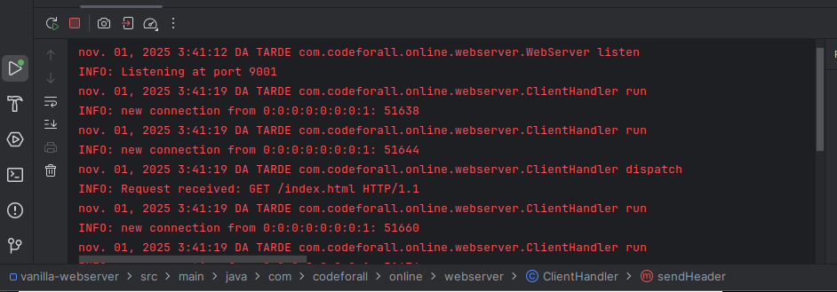

# 🖥️ Vanilla Web Server

Simple multithreaded HTTP server built entirely in **Java**.  
It serves static files from the `src/main/www` directory using a **fixed thread pool** to handle multiple clients simultaneously.

---

## ⚙️ Features
- 🧵 Handles multiple client connections concurrently (`ExecutorService`)
- 📄 Serves static files (`.html`, `.css`, `.png`, `.ico`)
- 🚫 Returns custom **404.html** when a file is not found
- 🧩 Detects content type automatically through the `ContentType` enum
- 💬 Clean, documented code with **Javadoc** and clear structure

---

## 📁 Project Structure

```
vanilla-webserver/
 ├─ src/
 │   └─ main/
 │       ├─ java/
 │       │   └─ com/codeforall/online/webserver/
 │       │       ├─ WebServer.java
 │       │       ├─ ClientHandler.java
 │       │       └─ utils/
 │       │           ├─ Header.java
 │       │           └─ ContentType.java
 │       └─ www/
 │           ├─ index.html
 │           ├─ 404.html
 │           ├─ styles.css
 │           └─ images/
 ├─ images/
 │   └─ webserver_running.png
 └─ README.md
```

---

## 🚀 How to Run

1. **Compile** the project (e.g., in IntelliJ or using Maven).  
2. **Run** the `Main` class:
   ```bash
   java com.codeforall.online.webserver.Main
   ```
3. Open your browser and visit:  
   👉 [http://localhost:9001](http://localhost:9001)

---

## 🧠 Example Console Output

```
INFO: Listening at port 9001
INFO: new connection from 127.0.0.1:54328
INFO: Request received: GET /index.html HTTP/1.1
```

---

## 🖼️ Screenshot


---

## 🧰 Technologies Used
- ☕ Java 17  
- 🧵 Concurrency (`ExecutorService`)  
- 💾 Java I/O  
- 🔍 Stream API  
- 🪵 Logging (`java.util.logging`)

---

## 👩‍💻 Author
**Kátia Vilarinho**  
Developed as part of a Java Full-Stack Bootcamp (Code For All_).

---

✨ *"Simple, clean, and built from scratch — a true vanilla web server."*
